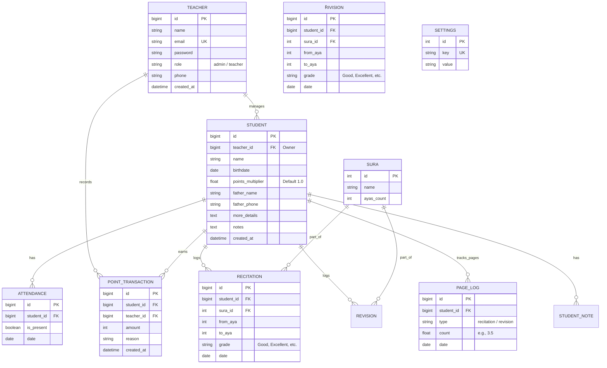

```mermaid
erDiagram
    TEACHER ||--o{ STUDENT : "manages"
    TEACHER ||--o{ POINT_TRANSACTION : "records"
    STUDENT ||--o{ ATTENDANCE : "has"
    STUDENT ||--o{ POINT_TRANSACTION : "earns"
    STUDENT ||--o{ RECITATION : "logs"
    STUDENT ||--o{ REVISION : "logs"
    STUDENT ||--o{ PAGE_LOG : "tracks_pages"
    STUDENT ||--o{ STUDENT_NOTE : "has"
    SURA ||--o{ RECITATION : "part_of"
    SURA ||--o{ REVISION : "part_of"

    TEACHER {
        bigint id PK
        string name
        string email UK
        string password
        string role "admin / teacher"
        string phone
        datetime created_at
    }

    STUDENT {
        bigint id PK
        bigint teacher_id FK "Owner"
        string name
        date birthdate
        float points_multiplier "Default 1.0"
        string father_name
        string father_phone
        text more_details
        text notes
        datetime created_at
    }

    SURA {
        int id PK
        string name
        int ayas_count
    }

    RECITATION {
        bigint id PK
        bigint student_id FK
        int sura_id FK
        int from_aya
        int to_aya
        string grade "Good, Excellent, etc."
        date date
    }

    ٌRIVISION {
        bigint id PK
        bigint student_id FK
        int sura_id FK
        int from_aya
        int to_aya
        string grade "Good, Excellent, etc."
        date date
    }

    PAGE_LOG {
        bigint id PK
        bigint student_id FK
        string type "recitation / revision"
        float count "e.g., 3.5"
        date date
    }

    ATTENDANCE {
        bigint id PK
        bigint student_id FK
        boolean is_present
        date date
    }

    POINT_TRANSACTION {
        bigint id PK
        bigint student_id FK
        bigint teacher_id FK
        int amount
        string reason
        datetime created_at
    }

    SETTINGS {
        int id PK
        string key UK
        string value
    }
```